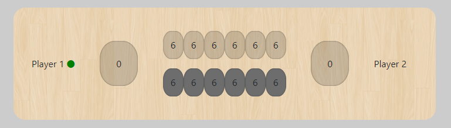

# Kalaha FrontEnd

This project is the frontend for the famous Kalaha game! 
This project was generated with [Angular CLI](https://github.com/angular/angular-cli) 

## Installation

In project's root, run `npm install`

## Development server

Run `ng serve` for a dev server. Navigate to `http://localhost:4200/`. The app will automatically reload if you change any of the source files.

## Board

After successful installation, this board should be displayed on your screen!

Enjoy! 

